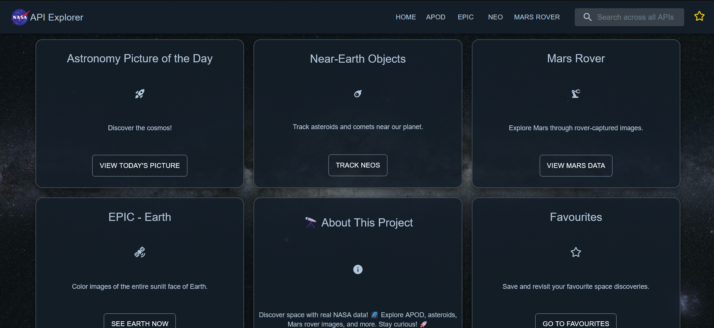
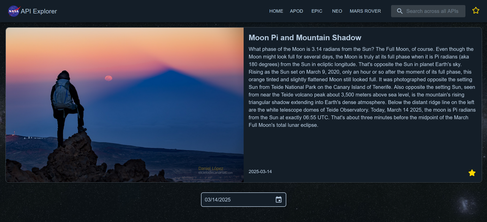
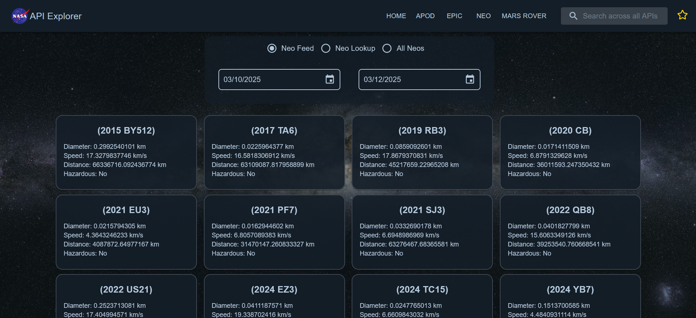
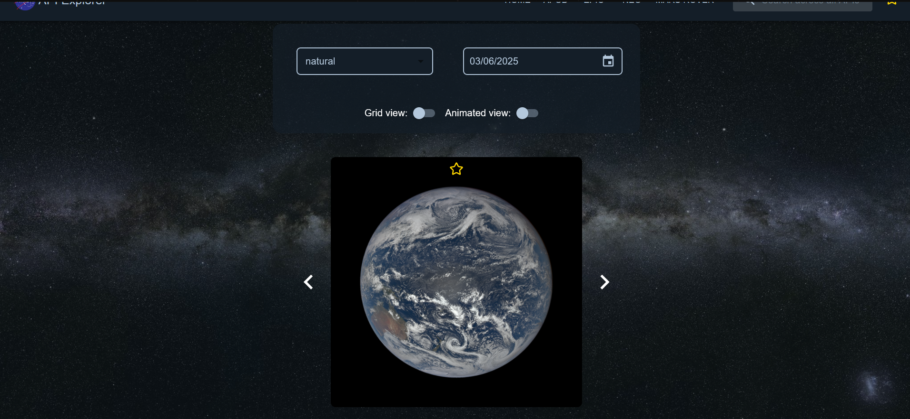
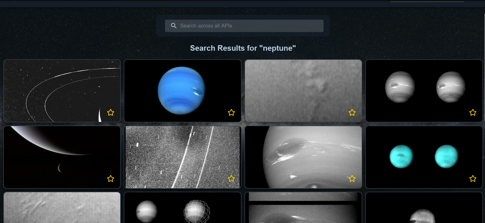

# **NASA Explorer**
A React-based web application that fetches and displays data from various NASA APIs. Users can explore Astronomy Picture of the Day (APOD), Mars Rover Photos, Near-Earth Objects (NEO), and Earth images from the EPIC camera. A search feature is also included to find NASA images and videos.  

## **🔗 Live Demo**  
[**Visit the Deployed Website Here**](https://gleeful-frangipane-cba232.netlify.app)  
## **📌 Features**  
✅ **Astronomy Picture of the Day (APOD)** – View NASA’s daily space image with a description.  
✅ **Mars Rover Photos** – Browse images taken by rovers on Mars. Filter by date, camera, and rover name.  
✅ **Earth Polychromatic Imaging Camera (EPIC)** – See images of Earth captured from space.  
✅ **Near-Earth Objects (NEO)** – Track asteroids near Earth with size, speed, and approach details.  
✅ **Search NASA Image Library** – Find images from NASA’s archives.  
✅ **Favorites** – Save your favorite images for later viewing.  
✅ **Pagination & Filtering** – Navigate large datasets efficiently.  
## **📸 Screenshots**  
  
  

  
    
 
---

# **Setup & Installation**
##  Clone repository
```
git clone https://github.com/Rabea25/nasaapp.git
cd nasaapp
```

##  Install packages
```
npm i
```

##  Add API key
Get Nasa API key from [here](https://api.nasa.gov/). <br>
Create .env file in the root of your project and set it to:
```
REACT_APP_NASA_API_KEY=your_api_key_here
```

## Start server
```
npm start
```
or if you want the website to be accessible from YourIP:port, edit package.json
```
"scripts": {
    "start": "react-scripts start",
```
to
```
"scripts": {
    "start": "HOST=0.0.0.0 PORT=yourport react-scripts start",
```


